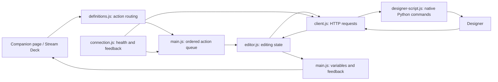

# Developer manual

This guide maps the core module architecture. For current behavior and release status, read [PROJECT-HANDOFF](PROJECT-HANDOFF.md) and [VIEWER-DEVELOPMENT](VIEWER-DEVELOPMENT.md) alongside it: these describe the newer browser editor, shared selection, clocks and concurrency rules. Historical track reports describe only their named builds, not certification of the current release.

## Continuing development

1. Clone the repository or extract the source ZIP. Follow [BUILD](BUILD.md) for the supported Node runtime, dependency installation and packaging commands.
2. Read `AGENTS.md`, the handoff and viewer development guide before changing behavior. Use the current source and tests as the implementation authority.
3. Run `npm test` and `npm run package`. The Windows release command builds clean Plus/XL exports and source/install bundles. Private live test helpers are intentionally excluded; local unit and package checks require no personal Designer project.
4. For hardware validation, configure your own Designer address, Companion connection and optional SMB credentials. Use a disposable track, preserve project backups, and verify only the changed behavior before wider testing.
5. Keep Designer calls behind the existing client/native script boundary and viewer commands in the shared validated edit queue. Do not bypass tokens, expected-key checks, locks, revision checks or LINK TIME behavior.
6. Update public documentation and changelog when changing behavior; keep personal settings and media outside Git. Inspect generated packages before publishing.

The repository contains no installed dependencies, passwords, private network configuration or licensed test media. Recreate those locally. The source package includes tests, package lockfile, build scripts and development documentation; the module TGZ is for installation, not source development.

### Recent viewer behavior

`viewer-page.js` owns pointer/keyboard UI, transient drag and wheel previews, snap targets, FOLLOW and menu controls. `viewer-editor.js` adapts validated browser requests to the same editor used by Stream Deck. `viewer-edit-model.js` updates every serialized parameter display copy after confirmation. `viewer-curve-preview.js` throttles extra native curve sampling, not mutation validation.

Wheel edits keep one guarded write in flight and accumulate the latest numeric target. Local curve deformation is approximate; Designer geometry remains authoritative. Empty timeline clicks release selected-key mode. Shortcuts are S snap, F follow, T fit track, L fit layer and Shift+L link time; text inputs and modified wheel gestures retain their own behavior. Live transport updates drive FOLLOW before the visible edge.

The 0.2 baseline ran 182 local tests and package lifecycle checks. This is not a new exhaustive live test of every layer, frame rate, SMB server or Raspberry Pi performance scenario.

## 1. What runs where

The module is a Node.js application hosted by Companion. Most files use CommonJS (`require` / `module.exports`); the small `entry.mjs` file exposes the exports expected by the Companion module loader.

Designer access uses two mechanisms:

- HTTP endpoints for connection checks, playback and thumbnails.
- Python scripts sent through Designer's HTTP Python execution endpoint. These run inside Designer and access its native tracks, layers, fields and sequences.

The Companion page is a separate generated configuration file. It supplies buttons, encoder bindings and display layouts. It is not the module's editing engine.



## 2. File map

| File | Responsibility |
| --- | --- |
| [`src/entry.mjs`](../src/entry.mjs) | Companion loader entry point; exports the instance class and upgrade-script list. |
| [`src/main.js`](../src/main.js) | Companion lifecycle, configuration, action queue, connection status, variables, thumbnail cache and UI state publishing. |
| [`src/definitions.js`](../src/definitions.js) | Action IDs/options/callbacks, feedback definitions, presets and preset groups. Routes controls according to the current editor mode. |
| [`src/editor.js`](../src/editor.js) | Selected layer/parameter/key, editing modes, value/time operations, resource browser and deletion confirmations. Has no dependency on the Companion SDK. |
| [`src/client.js`](../src/client.js) | HTTP requests, timeouts, cancellation, response validation and thumbnail validation. Builds Python requests through `makeScript()`. |
| [`src/designer-api.js`](../src/designer-api.js) | Designer endpoint paths and response-envelope decoding. First place to inspect for REST API changes. |
| [`src/designer-script.js`](../src/designer-script.js) | Python script generator: native metadata discovery, resource lookup, time conversion, validated sequence and layer mutations. |
| [`src/connection.js`](../src/connection.js) | Health probing, sequential live-state polling, feedback invalidation and heartbeat pulses. Also contains the optional LiveUpdate implementation. |
| [`src/companion-api.js`](../src/companion-api.js) | Central SDK import boundary. Re-exports `InstanceBase`, `InstanceStatus` and `combineRgb`; it is not a complete SDK compatibility adapter. |
| [`src/timecode.js`](../src/timecode.js) | Duration formatting, fractional-frame-rate/drop-frame labels and lookup of native absolute timecode samples. |
| [`src/layer-types.js`](../src/layer-types.js) | Native class names to readable layer-type names, with a fallback for unknown types. |
| [`src/theme.js`](../src/theme.js) | Shared colours and font-size settings. |
| [`src/demo.js`](../src/demo.js) | Offline simulation used by tests. Demo is not offered as a user configuration option. |
| [`scripts/build-page.cjs`](../scripts/build-page.cjs) | Generates the importable `.companionconfig` page using presets, variables and layered display elements. |
| [`templates/button-style.json`](../templates/button-style.json) | Base Companion layered-button schema cloned by the page generator. |
| [`scripts/verify-package.mjs`](../scripts/verify-package.mjs) | Smoke-tests the bundled module with a Companion host context. |
| [`scripts/release.ps1`](../scripts/release.ps1) | Runs checks/builds, stages explicitly allowed files, creates ZIP archives and SHA-256 checksums. |
| [`companion/manifest.json`](../companion/manifest.json) | Companion module identity, compatibility metadata and technical version. |
| [`companion/HELP.md`](../companion/HELP.md) | Help distributed with the module. |
| [`build-config.cjs`](../build-config.cjs) | Extra documentation copied into the runtime package. |
| [`package.json`](../package.json) | Runtime/build dependencies, Node version requirement and npm commands. |

## 3. The editor's data model

`Editor.snapshot` is the last full metadata read. It includes track and transport UIDs, timing information and a list of layers. A layer contains its UID, name, native module type, start/end times, numeric/enum `fields`, resource `mediaFields`, and native `controlOrder`.

A numeric field carries its native `name`, readable `label`, evaluated `value`, bounds, optional enum `choices`, animation capability, sequencing state and keys. Resource fields use a separate browser because their values are references to Designer objects rather than numbers.

**Identity and display names serve different purposes.** Send `field.name` to Designer; show `field.label` to the user. Keep UIDs as strings: native identifiers can exceed JavaScript's safe integer range. Array indexes describe presentation order, not persistent identity.

Important editor state:

| State | Meaning |
| --- | --- |
| `layerIndex`, `fieldIndex` | Current selection within the snapshot. |
| `time` | Playhead position in track-relative seconds. |
| `value` | Value used by the editor display; live operation reads Designer's evaluated value. |
| `selectedKeyTime` | A keyframe edit target; distinct from the playhead's interpolated value. |
| `moveKey` | Explicit SELECT KEYFRAME lock, including the expected key state. |
| `precision`, `timeStep` | Value increment mode and timeline increment mode. |
| `layerEdit`, `mediaMode` | Layer timing and resource browsing modes. |
| `clearKeysBrowser`, `clearKeysPrompt` | Deletion target list and explicit bulk-operation confirmation. |
| `busy`, `stale` | A remote operation is running, or metadata must be refreshed. |
| `pendingJump`, `navigationTime` | Protect navigation from delayed feedback while Designer catches up. |

## 4. Following one encoder operation

For a VALUE turn in the normal parameter view:

1. The generated page invokes the `value` action with a direction.
2. `definitions.js` routes it to `Editor.adjustLiveValue()` through `instance.perform()`.
3. `main.js` queues the action behind earlier encoder detents. It refreshes stale context when needed and rejects gestures whose target has changed.
4. The editor supplies track, transport, layer, field, precision and selected-key context to `client.execute('adjust_value', ...)`.
5. `DesignerClient` calls `makeScript()` and POSTs the resulting Python script.
6. Inside Designer, the script rechecks identity and live state, calculates the permitted value, updates the appropriate key or constant, and returns the native field state.
7. `Editor.acceptLive()` accepts the result. `main.publish()` updates Companion variables and feedback; page expressions redraw the controls.

Value rotation does not automatically create a new numeric keyframe. Pressing VALUE explicitly requests `key_set`; fields marked `canAnimate === false` ignore that request. Enum values follow their native choices rather than arbitrary numeric increments. Float precision modes normally use 0.1, 0.01 and 0.001.

New numeric keys explicitly use `Key.cubic` (SMOOTH). Writing a key at an existing time preserves its interpolation instead of resetting it.

The older local `adjustValue()`, `adjustTime()` and `write()` paths remain for compatibility with existing action definitions and tests. Do not replace live read-before-write operations with these paths just because their implementation is shorter.

## 5. Native Python command layer

`makeScript(command, args)` serializes the command payload into a script containing shared helpers and command branches. Keeping native access here avoids spreading Designer-specific classes and methods throughout the JavaScript editor.

| Commands | Purpose |
| --- | --- |
| `refresh`, `live_state`, `read_field` | Full metadata, lightweight timeline/selected-field feedback, and a current field read. |
| `playback_state`, `seek`, `nudge_time` | Read playback state and position the transport. Play/stop writes themselves use REST endpoints. |
| `adjust_value`, `key_set`, `constant_set`, `key_delete`, `key_clear` | Value and sequence writes, including retained compatibility commands. |
| `jump_key`, `select_key`, `key_move`, `key_type` | Key navigation, selection, movement and interpolation changes. |
| `key_clear_list`, `keys_clear`, `parameter_default`, `layer_default` | Discover clearable fields and apply deletion/default operations. |
| `media_list`, `media_set`, `media_key_set` | Enumerate typed resources and update resource sequences. |
| `layer_edit` | Move, trim and fit a layer. |

Helpers resolve readable parameter labels, enum choices, resource types and native defaults. A constant still has a native carrier key; `disableSequencing` distinguishes that from an animated parameter. Resetting a sequence retains one carrier at the layer start and disables sequencing.

The native layer validates targets before writing. Bulk default operations preflight supported fields, but they are **not transactional rollback operations**: a native failure during a multi-field write can leave partial changes. Never add automatic write retries; a timed-out request may already have executed.

## 6. Synchronisation and race prevention

`Connection.check()` probes the active-transport REST endpoint, normally every five seconds. Production live feedback uses `live_state` polling: each request finishes before the next is scheduled 500 ms later. A slow Designer therefore slows feedback instead of accumulating overlapping polls. LiveUpdate is disabled in production because of faults observed with the tested Designer version.

`main.requestSync()` refreshes missing/stale metadata. Timeline feedback updates time and bounds; a changed set of layers at the playhead triggers a metadata refresh. This is not a general subscription to every possible content-dependent field change.

Several guards work together:

- `perform()` preserves encoder order. A failed action advances `queueGeneration`, invalidating queued gestures from that generation.
- `Editor.remote()` marks remote work busy; ordinary feedback must not overwrite an edit in progress.
- `Connection.invalidateFeedback()` clears cached feedback and advances a revision before and after actions. A poll started under an older revision is discarded, even if it concerns the same parameter. This prevents a health check from replaying an old constant value after a keyframe was created.
- `pendingJump` briefly rejects feedback for an older playhead position.
- Layer identity follows UIDs when native layer order changes.

Designer mouse layer selection is followed when the selection changes. An unchanged Designer highlight must not repeatedly override an encoder selection. The parameter opened by the Designer mouse is not followed, and an encoder layer selection does not select Designer's native GUI widget.

Heartbeat is a short pulse triggered by a validated Designer response. Its timer only ends the pulse. Healthy metadata synchronisation retains an OK connection status; actual connection/write errors remain visible.

## 7. Keyframes, time and layer editing

SELECT KEYFRAME selects the nearest eligible key, breaking equal-distance ties toward the next key, and may move the playhead. Pressing it again releases the lock. While locked, layer and parameter selection are disabled; time-step, value and interpolation changes remain available. A constant without animation cannot enter this mode.

PREV/NEXT navigate the selected parameter's in-range keys. When there is no further key, navigation stops at exact IN or OUT (the end boundary of the last displayed frame). Moving a key uses current layer bounds and checks its expected state; it must not silently overwrite a different key.

LAYER EDIT maps the encoders to IN, POSITION, OUT and FIT. POSITION displays the layer centre and moving the layer carries the playhead by the same displacement. Timing operations clamp against track bounds. FIT uses available native content-duration information; do not assume every resource has a usable duration.

JavaScript uses seconds; Python converts to/from Designer beats. A frame step uses the actual transport FPS. `timecode.js` formats durations, while absolute positions prefer Designer's native timecode samples so markers/offsets are respected. If native mapping exists but a requested sample is missing, the display uses a placeholder rather than showing a misleading relative time. Drop-frame affects labels, not frame duration.

## 8. Resource browsing and deletion

RESOURCES opens a separate view with SOURCE, FOLDER, RESOURCE and BACK encoders. `loadMedia()` reads resources compatible with the selected resource field. `mediaAll` is the complete list; `mediaItems` filters it by folder; `mediaPage` selects eight visible items.

Turning the resource encoder previews a choice locally. Pressing it applies the typed reference and returns to the parameter view. A thumbnail button applies its item directly. Mapping, palette and audio-output selections reference Designer resources; this editor does not modify those resources' internal configuration.

`mediaKeyframe` chooses the write policy. SOURCE press toggles it only when `mediaCanAnimate` is true; opening the browser or changing SOURCE resets it to REPLACE. `media_snapshot()` supplies the native animation capability. `setMedia()` sends either `media_set` or `media_key_set` with the preview UID. In KEYFRAME mode the native code validates the reference, preserves the previous constant at IN when enabling sequencing, and inserts the new resource at the live playhead. These are discrete resource switches, not numeric interpolation or crossfades. The eight thumbnail buttons honour the same policy.

`main.loadThumbnails()` retrieves visible thumbnails, caches them by UID and discards results for an obsolete display batch. `client.thumbnail()` accepts bounded PNG responses; missing or invalid thumbnails can be represented without turning them into editing errors.

DELETE's down/up events distinguish a short press from a one-second hold. A hold opens the clear menu and a red indication marks the threshold. The browser includes animated numeric and resource parameters. Confirmations retain the original track/layer/field target so a later selection cannot redirect a deletion.

DELETE ALL preserves the current value while removing animation. DELETE ALL + DEFAULT restores the native field default. DEFAULT ALL PARAMETERS resets every supported field on the selected layer, including keys outside IN/OUT. A layer with no supported fields is a harmless no-op after confirmation. Free-text sequences remain unsupported.

## 9. Display and page generation

`main.publish()` is the presentation boundary. It produces `pad_*`, `dial_title_*`, `dial_value_*`, `dial_info_*`, heartbeat and state variables. Uppercase conversion applies to display text, not native field names, UIDs, resource paths or image data.

The page generator binds those variables to layered button elements. `theme.js` supplies colours and font settings, but geometry is defined in `build-page.cjs`. Companion sizes text relative to its element height: matching fontsize numbers alone is not enough to guarantee matching rendered text sizes. The layer-type label and LAYER heading use matching heights and font settings.

Use these edit points:

| Desired change | Edit here |
| --- | --- |
| Wording or displayed value | `main.publish()`; check preset text in `definitions.js` too. |
| Shared colour/font style | `theme.js`. |
| Alignment, element size or button layout | `scripts/build-page.cjs`. |
| What a control does in each mode | `definitions.js`, then the relevant Editor method. |
| Friendly layer-type name | `layer-types.js`. |
| Friendly parameter name or enum choices | Native metadata helpers in `designer-script.js`. |

Regenerate and import the page after layout changes. Replacing the module alone does not replace an already imported page. Preserve action/variable IDs and the internal module ID `disguise-layer-control`: saved Companion pages depend on them. The public product name is Disguise Layer Editor.

## 10. Extending and maintaining the integration

For a new action, define its native behaviour and validation in `designer-script.js`, expose it through an Editor method, add a stable action ID in `definitions.js`, and wire it into the page only if it needs a visible control. Add the relevant tests before live validation on a disposable track.

For a Designer API change, start with `designer-api.js` for REST and `designer-script.js` for native objects. For a Companion change, inspect `companion-api.js`, `main.js`, action schemas, manifest/SDK versions and the generated page schema. These boundaries localise changes; they do not make unknown upstream versions automatically compatible. The [architecture reference](ARCHITECTURE.md) maps boundaries to checks.

Never use a readable label as an identifier, convert UIDs to numbers, retry writes blindly, hide real write failures, or publish raw project logs as test fixtures.

## 11. Tests, builds and release files

| Check | What it covers |
| --- | --- |
| `test/editor.test.js` | Editor state, selection, controls and sequencing policies. |
| `test/live-editor.test.js` | Live-command behaviour and generated native-script safeguards. |
| `test/client.test.js` | HTTP boundary, validation and request behaviour. |
| `test/connection.test.js` | Polling, optional subscriptions, heartbeat, stale-response handling and cleanup. |
| `test/definitions.test.js` | Actions/presets, public definitions and selected presentation/status behaviour. |
| `test/timecode.test.js` | Frame-rate, absolute-timecode and drop-frame formatting. |
| `scripts/verify-package.mjs` | The actual bundled module's basic host integration. |

Use Node.js 22.22.0 and the lockfile:

```sh
npm ci
npm test
npm run format:check
npm run package
```

`npm run package` produces the versioned module `.tgz` and the importable Companion page. On Windows, `npm run release` also produces source/installation ZIPs and checksums. `-- -Force` replaces a previous local release directory. See [build instructions](BUILD.md).

Generated archives, local tools, media, test projects and raw evidence are excluded from Git. `release.ps1` uses an explicit documentation/source allowlist; add new distributable documentation there. Review the actual archive contents before publication. Increment the technical version for changed published module builds and keep the manifest, lockfile, filenames and documentation consistent. Documentation-only Git changes do not require replacing a published binary or moving its tag.

Offline tests do not prove native rendering or hardware output. Live tests need an authorised test environment and a backup; record what was actually exercised and keep unsupported cases visible. Refer to [known limitations](../KNOWN-LIMITATIONS.md), [contributing](../CONTRIBUTING.md) and [security](../SECURITY.md) before sharing changes.

See [viewer development](VIEWER-DEVELOPMENT.md) and [project handoff](PROJECT-HANDOFF.md) for current architecture and continuation instructions.
